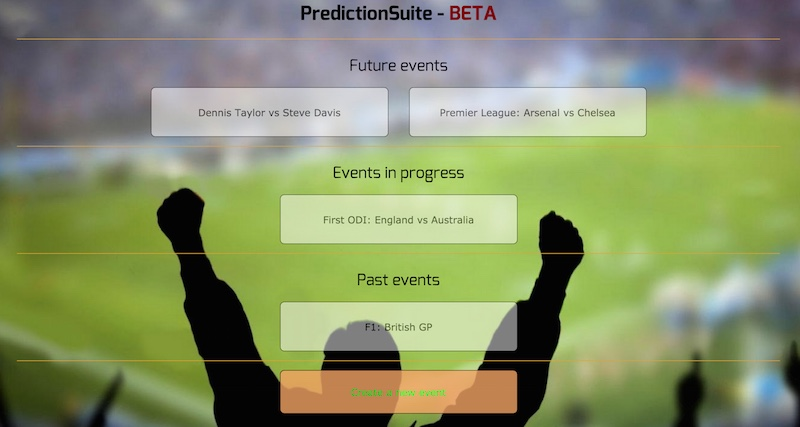
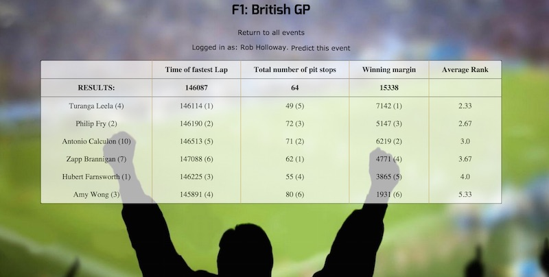

#WDI15 - Project 2 - PredictionSuite
_____________________________________________________________

##The app

For the rails project I decided to make a sports prediction game called PredictionSuite (because each event is a suite of three predictions, and it sounds a bit like the hugely popular football prediction game (http://www.thepredictionsite.com "thePredictionsite.").

The idea of the game is for a user to log in and make a trio of predictions for each event.  Within an event, each unique combination of predictions is available only once.  So, in the case of a football match, if one user selects a final score of 2-1, the time of first goal at 16 minutes and the time of the first booking at 41 minutes, no other user can make this same combination of predictions.

Once the event is over, users' predictions are ranked by closeness to the actual result, and an average of their three ranks is given as their final score.  The lower the average rank, the better.

##Technology

The app is built using ruby on rails.  No additional gems were needed, although the initial build did make use of Foundation for the layout, but this was abandoned due to the difficulties in styling Foundation elements.  Uninstalling Foundation seems to be rather tricky, so I removed as much of it as I could, but one or two existing CSS quirks suggest I was not entirely successful with this.

##Screenshots

The home page, which is the index of the Event model:

The table of results including in brackets each user's rank for the individual predictions, and the average rank in the right-hand column.  The table is orderded by lowest rank first so the "best" predictor for this event is at the top:

##Limitations and next steps

The following functionality is still to be added:

* Ability for users to amend their predictions up to the event start time
* prevention of multiple predictions from one user
* prevention of predictions in active or expired events
* prevention of duplicated predictions
* a leaderboard spanning multiple events
